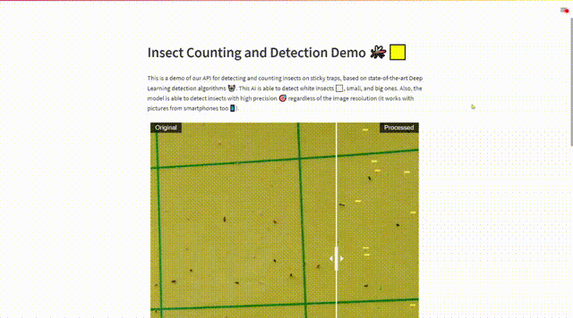

# Insect detection Demo App
Application for a detection system that is able to automatically count the number of insects, including whiteflies, using state-of-the-art and deep learning models.

### Try it!
Link of the demo app: https://gonzalorecio-insect-detection-demo-app-main-drz66u.streamlitapp.com/

### Demo of the app:

